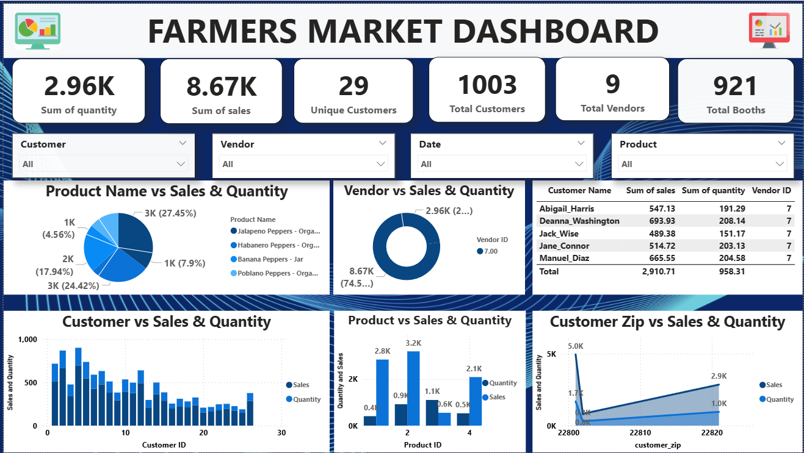
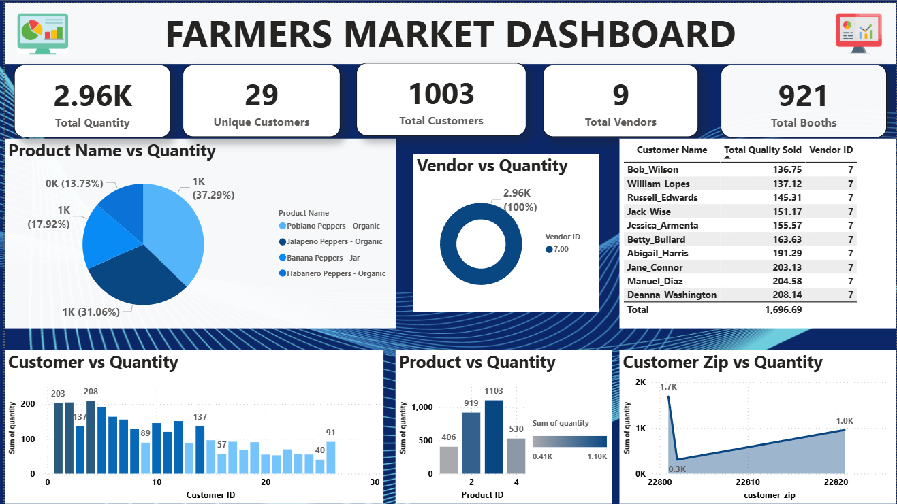
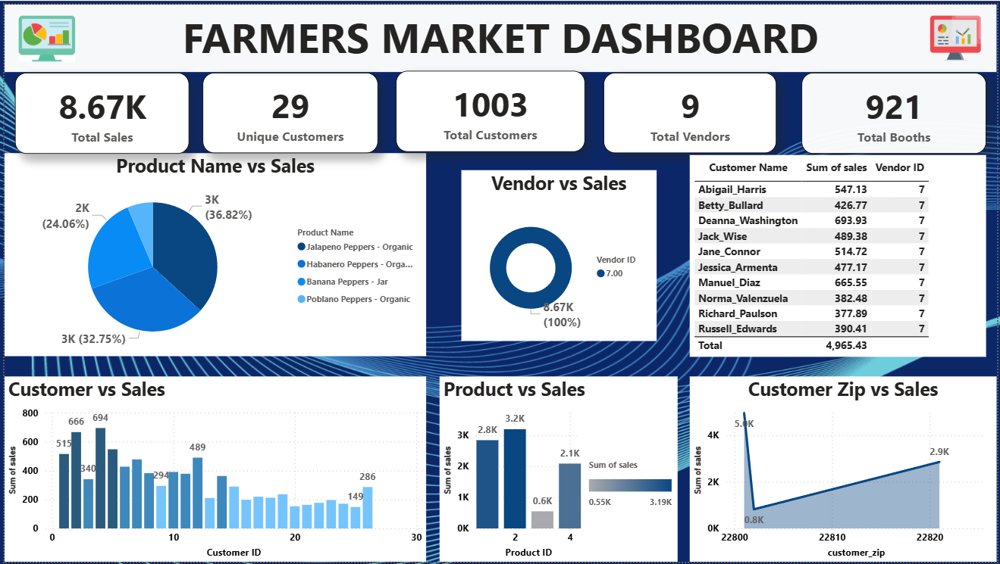

# 📊 Power BI Dashboard: [Farmer Market Dashboard ]

## 🔍 Overview
This Power BI dashboard provides a comprehensive analysis of **[Sales and Quantity Analysis]**. It was built to showcase interactive data storytelling, DAX-driven insights, and recruiter-facing design principles.

## 🛠️ Tools & Technologies
- **Power BI Desktop** (.pbix)
- **DAX** for calculated columns and measures
- **CSV** as data sources
- **GitHub** for version control and portfolio sharing

## 📈 Key Features
- Dynamic filters and slicers for real-time data exploration
- KPI cards highlighting core metrics
- Trend analysis using line and bar charts
- Drill-through pages for detailed breakdowns
- Custom visuals for enhanced storytelling

## 📁 Files Included
- `dashboard.pbix` – Main Power BI file
- `/images` – Screenshots of key visuals
- `README.md` – This documentation
- `resources` –  Sample dataset used

## 🧠 Insights Uncovered
- [Top 5 Customers by Sales Sum]
  -1.Abigail_Harris: 547.33
  -2.Deanna_Washington: 639.93
  -3.Jack_Wise: 489.39
  -4.Jane_Connor: 514.72
  -5.Manuel_Diaz: 665.55

## 🚀 How to Use
1. Clone this repo
2. Open `dashboard.pbix` in Power BI Desktop
3. Refresh data sources if needed
4. Explore visuals and interact with filters

## 📸 Screenshots
-Sales and Quantity Analysis

-Quantity Analysis

-Sales Analysis

## 📢 Author

**Sanya Agarwal** – Business Analyst

## 🏁 Status
✅ Completed  
📌 Open to feedback and collaboration

